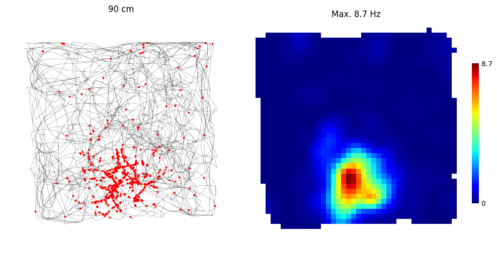
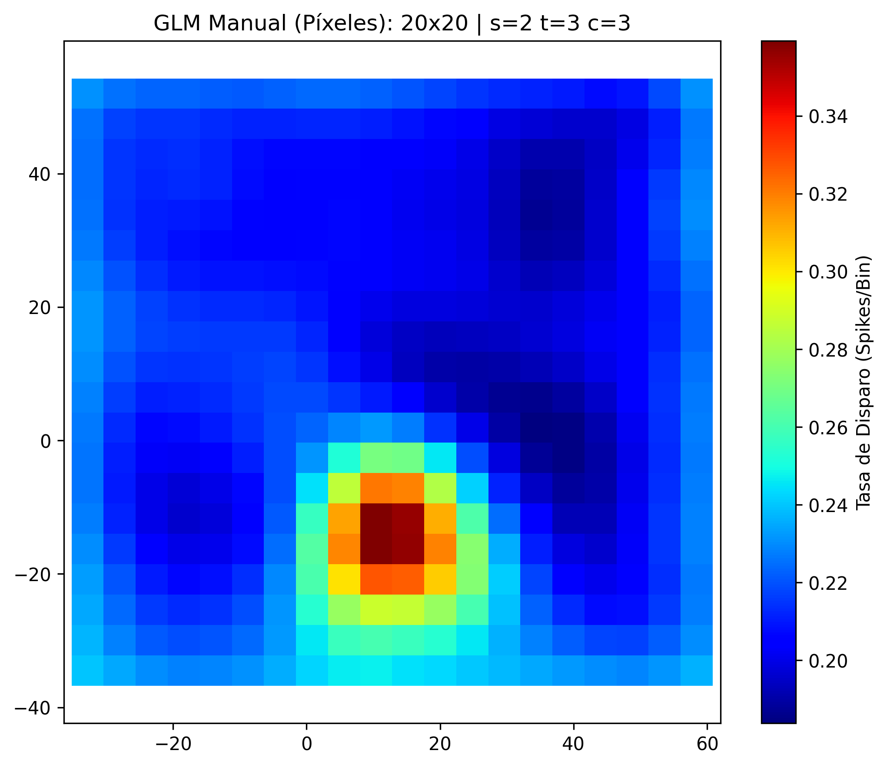
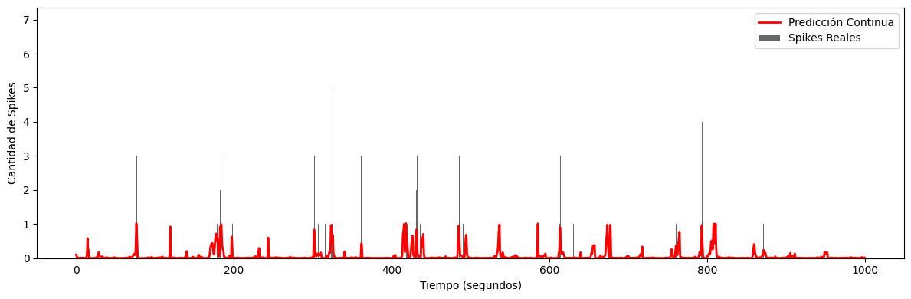
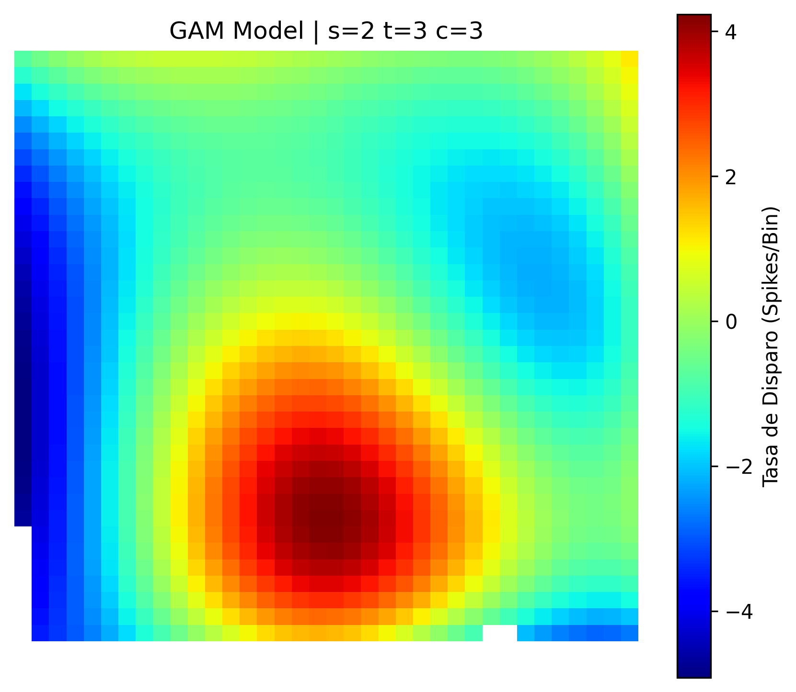
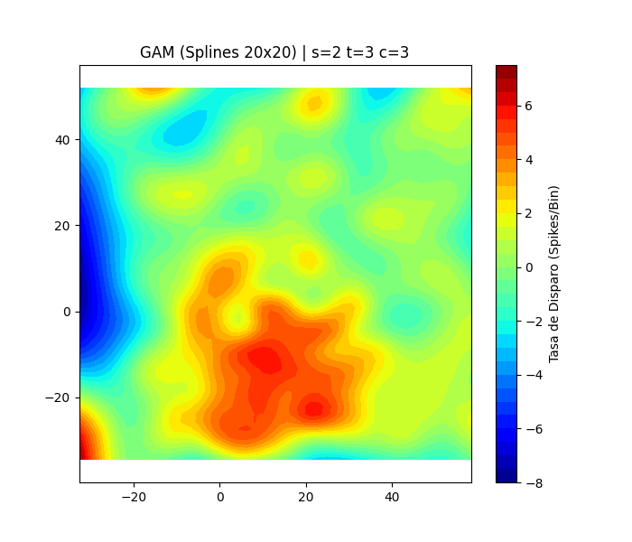
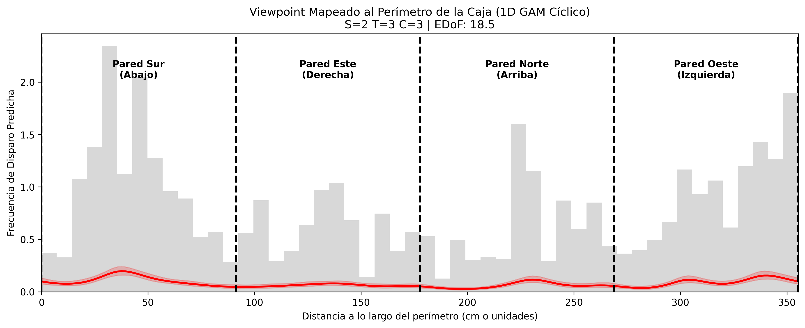

# Degus análisis espacial

Pipeline de análisis de place cells hipocampales en *Octodon degus*. El notebook `playground.ipynb` ejecuta las secciones en el siguiente orden:

---

## 1. Firing Map (`firing_map` / `rate_map`)
Dentro de los scripts herramientas (`utils.py`), el método principal es `firing_map(sesion, tetrodo, neurona)`. Este método nos permite visualizar la actividad de una neurona individual durante una sesión en el Open Field (OF). 

El método realiza lo siguiente:
- Grafica la **trayectoria completa del animal** en gris claro con un filtro gaussiano.
- Superpone en **puntos rojos** las posiciones interpoladas donde la neurona seleccionada disparó un potencial de acción.
- Aplica un **filtro de velocidad** (por defecto > 2 cm/s) para omitir los disparos que ocurren cuando el animal está quieto.

Esta es nuestra **place cell** candidata (sesión 2, tetrodo 3, célula 3) 

---

## 2. GLM Posición (`glm_posicion_manual`)
Ajustamos un Modelo Lineal Generalizado (GLM) de manera manual dividiendo el espacio mediante una grilla de funciones base independientes, asumiendo una distribución de Poisson para los spikes.

El espacio se fracciona en cuadraditos, y el modelo ajusta el peso de cada región por separado. El algoritmo cuenta con regularización (ridge) para que los bines que el animal nunca pisó no "exploten".

---

## 3. GAM Espacial — Place Cells (`get_gam_posicion` / `graficar_gam_posicion`)
Modela la respuesta de la neurona puramente a la posición (X, Y) usando **Splines**. El GAM encuentra la penalización óptima mediante cross validation.

- **Serie temporal ("Predicción vs Realidad")**: En negro se ven las barras que representan los disparos (spikes) discretos reales que disparó la neurona. La línea roja continua superpuesta es lo que el modelo GAM predice que debería haber disparado basándose exclusivamente en la posición exacta del degú en ese momento.

- **Place field predictivo**: El place field se expresa como un gradiente suave y continuo, reflejando de manera más natural la probabilidad espacial de la célula (comparar con modelos lineales).

### Modelado
- **Bineado Temporal ($Y$)**: Dado que la cámara y los electrodos miden datos de distinta naturaleza, discretizamos el tiempo en vetanas. Esto nos permite construir el vector de spikes por ventana alineado con la trayectoria, generando las filas de entrenamiento necesarias para el Poisson GAM.
- **Validación Cruzada (Gridsearch)**: El GAM utiliza una penalidad ($\lambda$) que se calibra automáticamente. Si se le otorgan muchas funciones base (splines), el *gridsearch* aumenta esta penalidad para aplastarlas, garantizando que la superficie final sea estadísticamente suave e indicando la complejidad real de los datos a través de los Grados de Libertad Efectivos (EDoF).
- **Overfit (Límite de Splines)**: Aunque la validación cruzada previene picos de ruido, es "ciega" al comportamiento animal. Si otorgamos demasiados splines (ej. 20x20), el modelo se sobreajustará *al recorrido exacto* del degú en lugar de a la codificación abstracta del hipocampo. Por eso restringimos el tope de complejidad (ej. `splines=5` o `6`) forzando al modelo a revelar únicamente los verdaderos place fields.

### Métricas del GAM (Ejemplo: Célula candidata con 5x5 splines)
Al entrenar el modelo, la librería nos devuelve un resumen estadístico. Para la neurona analizada (Sesión 2, Tetrodo 3, Neurona 3), los valores clave para validar su función espacial son:

- **Rank (25)**: Es el número máximo de funciones base que le permitimos usar al modelo ($5 \times 5 = 25$).
- **Effective DoF (14.3)**: Grados de Libertad Efectivos. De las 25 campanas disponibles, el modelo utilizó la complejidad equivalente a ~14 para dibujar el mapa, penalizando y aplanando el resto. Encontró una forma estable sin necesidad de usar toda la complejidad disponible.
- **Pseudo R-Squared (0.4054)**: Indica que el **40.5%** de la variabilidad en los disparos de la neurona se explica exclusivamente por la posición (X, Y) del animal.
- **AIC (4814.3)**: Criterio de Información. Útil para comparar modelos relativos a los mismos datos. Modelos sobreajustados (ej. 20x20 splines) pueden dar un AIC menor al memorizar las pisadas del degú; aceptamos este valor como el "costo" necesario para obtener una representación biológicamente representativa.
- Ejemplo:

---

## 4. GAM Viewpoint — Mirada / Paredes (`get_gam_viewpoint_1d` / `graficar_gam_viewpoint_1d`)
Desenrolla la caja del Open Field y calcula la respuesta de la neurona hacia la mirada (viewpoint) del animal usando **GAMs 1D**. Se busca ver si la neurona también responde a la dirección de la mirada o al ángulo de visión hacia las paredes del entorno.

