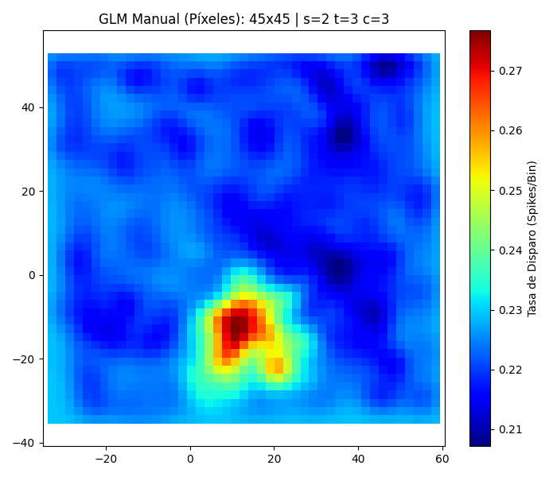
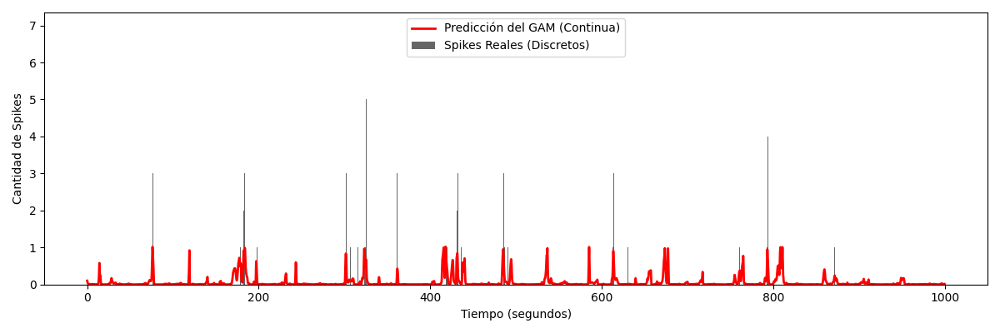
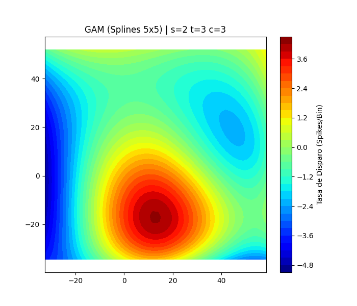

### Análisis Espacial (`firing_map`)
Dentro de los scripts herramientas (`utils.py`), el método principal es `firing_map(sesion, tetrodo, neurona)`. Este método nos permite visualizar la actividad de una neurona individual durante una sesión en el Open Field (OF). 

El método realiza lo siguiente:
- Grafica la **trayectoria completa del animal** en gris claro (con un suavizado gaussiano).
- Superpone en **puntos rojos** las posiciones exactas donde la neurona seleccionada disparó un potencial de acción.
- Aplica un **filtro de velocidad** (por defecto > 2 cm/s) para omitir los disparos que ocurren cuando el animal está quieto.

Podemos ver el resultado devuelto por esta función. Esta es nuestra **place cell** candidata (sesión 2, tetrodo 3, célula 3) 

### Modelado Estadístico: GLM y GAM (`glm_analysis.py`)
Para evaluar la codificación espacial de la neurona, utilizamos Modelos Lineales Generalizados (GLM) y Modelos Aditivos Generalizados (GAM) asumiendo una distribución de Poisson para los spikes.

#### GLM Manual (Figura 3)
Ajustamos el modelo de manera manual dividiendo el espacio mediante una grilla de funciones base independientes.

El espacio se fracciona en muchísimos cuadraditos, y el modelo ajusta el peso de cada región por separado. El algoritmo cuenta con regularización (ridge) para que los bines que el animal nunca pisó no "exploten".

#### GAM Automático con Splines (GAM 1 y GAM 2)
En otro acercamiento, implementamos un GAM utilizando **Splines** que encuentra la penalización óptima mediante cross validation.

- **GAM 1**: Serie temporal ("Predicción vs Realidad"). En negro se ven las barras que representan los disparos (spikes) discretos reales que emitió la neurona. La línea roja continua superpuesta es lo que el modelo GAM predice que debería haber disparado basándose exclusivamente en la posición exacta del degú en ese momento.

- **GAM 2**: Es el place field predictivo del GAM. El place field se expresa en este caso como un gradiente suave y continuo, reflejando de manera mucho más natural la verdadera probabilidad espacial de la célula (comparar con modelos lineales).

#### Fundamentos del Modelado
- **Bineado Temporal ($Y$)**: Dado que la cámara de video (posición) y los electrodos (spikes) recogen datos de distinta naturaleza, discretizamos el tiempo en "ventanas" (ej. 100 ms). Esto nos permite construir el vector de spikes por ventana alineado con la trayectoria, generando las filas de entrenamiento necesarias para la Regresión de Poisson.
- **Validación Cruzada (Gridsearch)**: El GAM utiliza una penalidad matemática ($\lambda$) que se calibra automáticamente. Si se le otorgan muchas funciones base (splines), el *gridsearch* aumenta esta penalidad para aplastarlas, garantizando que la superficie final sea estadísticamente suave e indicando la complejidad real de los datos a través de los Grados de Libertad Efectivos (EDoF).
- **Miopía Biológica (Límite de Splines)**: Aunque la validación cruzada previene picos de ruido, es "ciega" al comportamiento animal. Si otorgamos demasiados splines (ej. 20x20), el modelo se sobreajustará *al recorrido exacto* del degú en lugar de a la codificación abstracta del hipocampo. Por ello, restringimos el tope de complejidad (ej. `splines=5` o `6`) forzando al modelo a revelar únicamente los verdaderos "Campos de Lugar" biológicos.

#### Interpretación de Métricas del GAM (Ejemplo: Célula candidata con 5x5 splines)
Al entrenar el modelo, la librería nos devuelve un resumen estadístico. Para la neurona analizada (Sesión 2, Tetrodo 3, Neurona 3), los valores clave para validar su función espacial son:

- **Rank (25)**: Es el número máximo de funciones base que le permitimos usar al modelo ($5 \times 5 = 25$). Actúa como nuestro límite de "miopía biológica".
- **Effective DoF (14.3)**: Grados de Libertad Efectivos. De las 25 campanas disponibles, el modelo utilizó la complejidad equivalente a ~14 para dibujar el mapa, penalizando y aplanando el resto. Demuestra que encontró una forma estable sin necesidad de usar toda la complejidad disponible.
- **Pseudo R-Squared (0.4054)**: ¡La métrica estrella! Indica que el **40.5%** de la variabilidad en los disparos de la neurona se explica pura y exclusivamente por la posición (X, Y) del animal. En electrofisiología *in-vivo*, un $R^2$ superior a 0.15 ya es considerado un *Place Cell* excepcionalmente fuerte.
- **AIC (4814.3)**: Criterio de Información. Útil para comparar modelos relativos a los mismos datos. Modelos sobreajustados (ej. 20x20 splines) pueden dar un AIC engañosamente menor al memorizar las pisadas del degú; aceptamos este valor como el "costo" necesario para obtener una representación biológicamente real.
