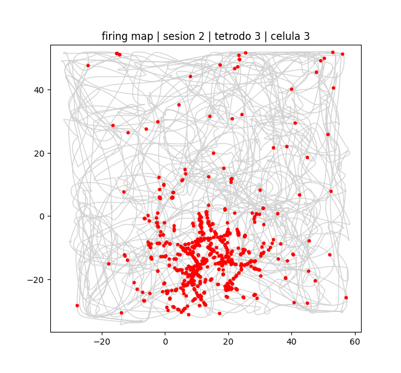

### Análisis Espacial (`firing_map`)
Dentro de los scripts herramientas (`utils.py`), el método principal es `firing_map(sesion, tetrodo, neurona)`. Este método nos permite visualizar la actividad de una neurona individual durante una sesión en el Open Field (OF). 

El método realiza lo siguiente:
- Grafica la **trayectoria completa del animal** en gris claro (con un suavizado gaussiano).
- Superpone en **puntos rojos** las posiciones exactas donde la neurona seleccionada disparó un potencial de acción.
- Aplica un **filtro de velocidad** (por defecto > 2 cm/s) para omitir los disparos que ocurren cuando el animal está quieto.

Podemos ver el resultado devuelto por esta función. Esta es nuestra **place cell** candidata (sesión 2, tetrodo 3, célula 3) 

